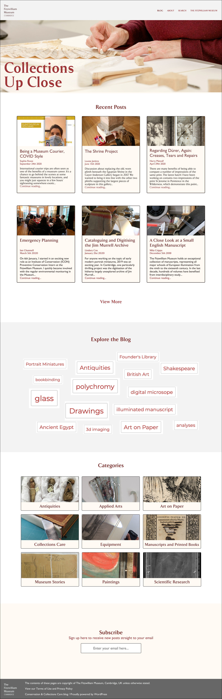
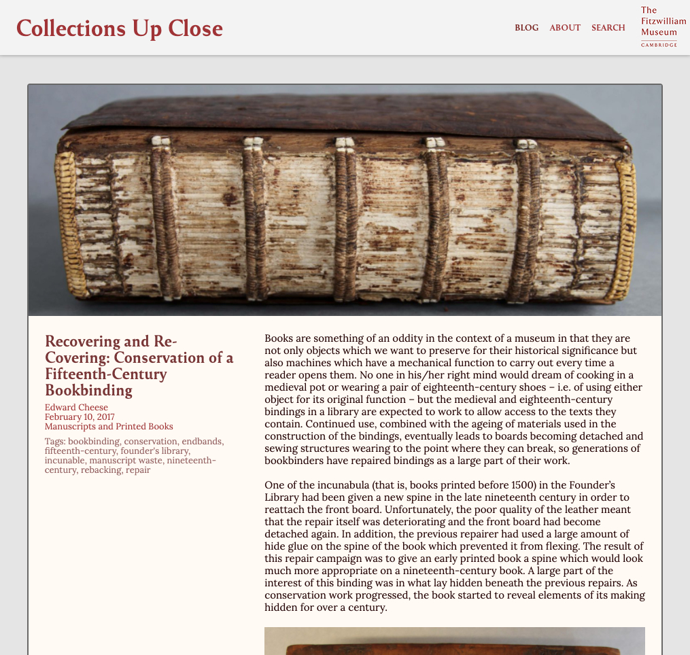
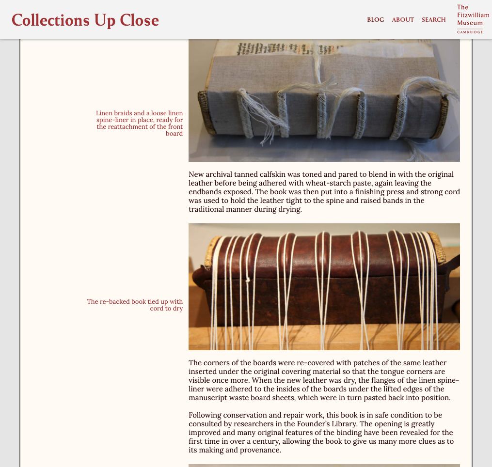

# Collections Up Close
A WordPress custom theme developed for the Fitzwilliam Museum Conservation Blog. The theme aims to bring the blog up to current standards of accessibility and ease-of-use, while allowing the rich current and future content of both text and image to shine. Priorities include responsive mobile-friendly design, and more attention paid to guiding our users towards other posts that they may be interested in.

### Images

### Installation

1. In your WordPress admin panel, go to Appearance > Themes and click the Add New button.
2. Click Upload Theme and Choose File, then select the theme's .zip file. Click Install Now.
3. Click Activate to use your new theme right away.

### Changelog

#### 0.1 - March 11, 2021
* Initial pre-release

### Credits

* Based on Underscores https://underscores.me/, (C) 2012-2021 Automattic, Inc., [GPLv2 or later](https://www.gnu.org/licenses/gpl-2.0.html)
* normalize.css https://necolas.github.io/normalize.css/, (C) 2012-2018 Nicolas Gallagher and Jonathan Neal, [MIT](https://opensource.org/licenses/MIT)

### Requirements
* Requires at least: 4.5
* Tested up to: 5.4
* Requires PHP: 5.6
